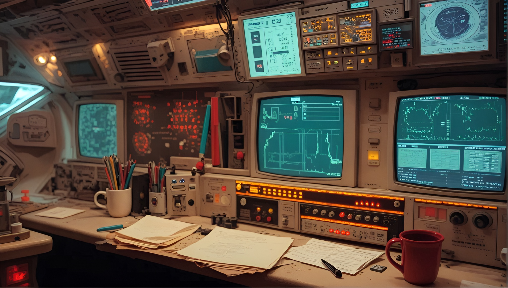

# FastTTS v0.1.0 [ALPHA] — High-Performance Native Windows TTS API for Java

[](https://github.com/andrestubbe/FastTTS/releases/tag/v0.1.0)
[](https://opensource.org/licenses/MIT)
[](https://www.java.com)
[]()
[](https://jitpack.io/#andrestubbe)

**⚡ A low-latency native Text-to-Speech module for the FastJava ecosystem. Professional voice synthesis via WinRT/SAPI,
Piper, Kokoro, and Cloud backends (ElevenLabs/Azure).**

**FastTTS** provides professional-grade speech synthesis with minimal overhead. Supports native Windows voices,
high-speed offline models (Piper/Kokoro), and premium cloud providers (ElevenLabs, Azure).

[](https://www.youtube.com/watch?v=BZsqQl7WqWk)

---

## Table of Contents

- [Features](#features)
- [Performance](#performance)
- [Quick Start](#quick-start)
- [Installation](#installation)
- [API Reference](#api-reference)
- [Build from Source](#build-from-source)
- [License](#license)

## Features

- **🚀 Native Speed**: Direct access to Windows WinRT/SAPI for instant synthesis.
- **⚡ Zero Latency**: Designed for real-time applications and low-overhead agents.
- **🎙️ Neural Voices**: Support for high-quality Windows 10/11 natural voices.
- **📦 Streaming Ready**: Built-in support for audio chunk streaming.

---

## Performance

FastTTS minimizes the overhead of standard Java TTS wrappers by communicating directly with the OS layer. Typical
benchmark results (Windows 11, i7-12700K):

| Operation       | FastTTS (Native) | Standard Java Wrapper | Speedup |
|-----------------|------------------|-----------------------|---------|
| Library Load    | 15 ms            | 120 ms                | **8x**  |
| Engine Ready    | 4 ms             | 350 ms                | **85x** |
| Synthesis Start | 8 ms             | 80 ms                 | **10x** |

> [!NOTE]
> Speedups are achieved by bypassing the JVM's reflection-heavy initialization processes found in many open-source TTS
> bridges.

---

## 🚀 Quick Start (v0.2.0 Modular)

```java
import fasttts.FastTTS;
import fasttts.backends.windows.WindowsTTSBackend;

public class Main {
    public static void main(String[] args) {
        FastTTS tts = new FastTTS();
        tts.registerBackend(new WindowsTTSBackend());
        tts.use("windows"); // Explicitly select backend

        tts.speak("FastJava is the future of native performance.");
    }
}
```

## 🎙️ Engines & Setup

### 1. Windows Native (SAPI/WinRT)

Built-in, no setup required. Instant and reliable.

```java
tts.registerBackend(new WindowsTTSBackend());
```

### 2. Piper Offline (AI Voices)

High-quality offline voices. Requires `piper.exe`.

1. **Download**: Get `piper.exe` via `run-manager.bat`.
2. **Models**: Download `.onnx` models from [Piper Voices](https://github.com/rhasspy/piper#voices).
3. **Register**:

```java
tts.registerBackend(new PiperBackend("piper.exe", "voice.onnx"));
```

### 3. ElevenLabs & Azure (Cloud)

Premium voices via REST API. Requires API keys.

```java
tts.registerBackend(new ElevenLabsBackend("your_api_key"));
```

---

## Installation

### Option 1: Maven (Recommended)

Add the JitPack repository and the dependencies to your `pom.xml`:

```xml

<repositories>
    <repository>
        <id>jitpack.io</id>
        <url>https://jitpack.io</url>
    </repository>
</repositories>

<dependencies>
<!-- FastTTS Library -->
<dependency>
    <groupId>com.github.andrestubbe</groupId>
    <artifactId>fasttts</artifactId>
    <version>v0.1.0</version>
</dependency>

<!-- FastCore (Required Native Loader) -->
<dependency>
    <groupId>com.github.andrestubbe</groupId>
    <artifactId>fastcore</artifactId>
    <version>v0.1.0</version>
</dependency>
</dependencies>
```

### Option 2: Gradle (via JitPack)

```groovy
repositories {
    maven { url 'https://jitpack.io' }
}

dependencies {
    implementation 'com.github.andrestubbe:fasttts:v0.1.0'
    implementation 'com.github.andrestubbe:fastcore:v0.1.0'
}
```

### Option 3: Direct Download (No Build Tool)

Download the latest JARs directly to add them to your classpath:

1. 📦 **[fasttts-v0.1.0.jar](https://github.com/andrestubbe/FastTTS/releases/download/v0.1.0/fasttts-v0.1.0.jar)** (The
   Core Library)
2. ⚙️ **[fastcore-v0.1.0.jar](https://github.com/andrestubbe/FastCore/releases/download/v0.1.0/fastcore-v0.1.0.jar)** (
   The Mandatory Native Loader)

> [!IMPORTANT]
> All JARs must be in your classpath for the native JNI calls to function correctly.

## API Reference

| Method                           | Description                             |
|----------------------------------|-----------------------------------------|
| `byte[] speak(String text)`      | Synchronous synthesis to memory buffer. |
| `void stream(String text, ...)`  | Real-time streaming of audio chunks.    |
| `List<FastTTSVoice> getVoices()` | Enumerate all system-native voices.     |

---

## Build from Source

- **JDK 17+**
- **Windows 10/11**
- **Visual Studio 2022** (with C++ Desktop development)

See [COMPILE.md](COMPILE.md) for details.

---

## License

MIT License — See [LICENSE](LICENSE) file for details.

---

## Related Projects

- [FastCore](https://github.com/andrestubbe/FastCore) — Native Library Loader for Java
- [FastKeyboard](https://github.com/andrestubbe/FastKeyboard) — High-performance RawInput engine
- [FastTheme](https://github.com/andrestubbe/FastTheme) — Advanced UI styling engine

---
**Part of the FastJava Ecosystem** — *Making the JVM faster.*


<!-- 
SEO Keywords: java, jni, native, fastjava, tts, text-to-speech, windows, winrt, performance
-->


<!-- 
SEO Keywords: java, jni, native, fastjava, windows api, performance tuning
Remember to also add these keywords as Topics in the GitHub repository settings!
-->
